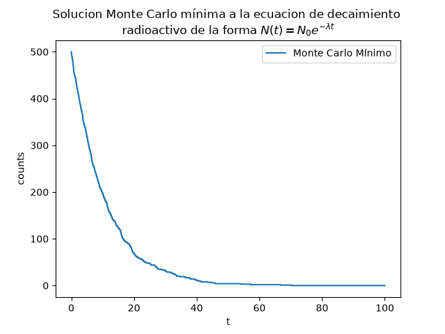

# Monte Carlo Simulation

Repositorio con caracter educativo sobre la implementacion del método Monte Carlo desde cero

1. Inicio: Método Monte Carlo mínimo

    

    solucion mediante generacion de probabilidades aleatorias en un arreglo 1D determinando que particulas han decaído

2. Comparación de solucion analítica continua y visualizacion de convergencia estadistica y reduccion de varianza

    

    definicion de función de decaimiento estableciendo como criterio de decaimiento la vida media generada aleatoriamente
