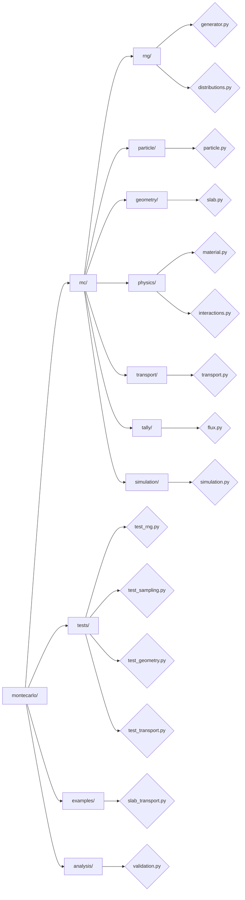

# Estructura del proyecto

```mermaid
flowchart LR
montecarlo[montecarlo/]
montecarlo --> mc[mc/]
montecarlo --> tests[tests/]
montecarlo --> examples[examples/]
montecarlo --> analysis[analysis/]
mc --> rng[rng/]
mc --> particle[particle/]
mc --> geometry[geometry/]
mc --> physics[physics/]
mc --> transport[transport/]
mc --> tally[tally/]
mc --> simulation[simulation/]
rng --> generator{generator.py}
rng --> distributions{distributions.py}
particle --> particle_file{particle.py}
geometry --> slab{slab.py}
physics --> material{material.py}
physics --> interactions{interactions.py}
transport --> transport_file{transport.py}
tally --> flux{flux.py}
simulation --> simulation_file{simulation.py}
tests --> test_rng{test_rng.py}
tests --> test_sampling{test_sampling.py}
tests --> test_geometry{test_geometry.py}
tests --> test_transport{test_transport.py}
examples --> slab_transport{slab_transport.py}
analysis --> validation{validation.py}
```
